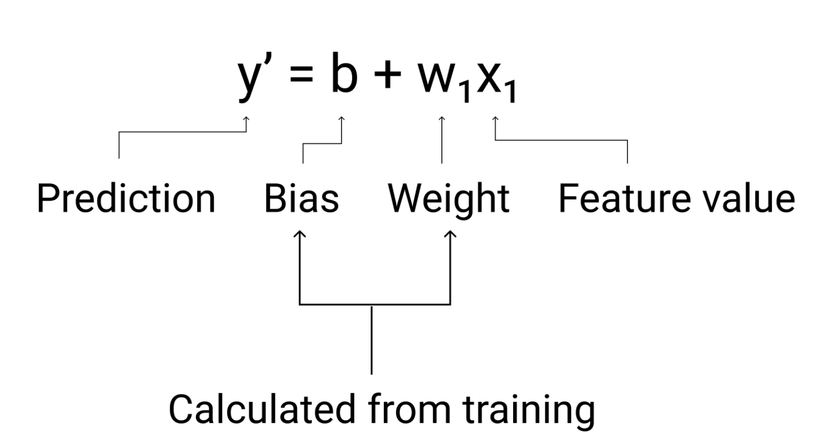

# Linear Regression 📈

Linear regression is a simple statistical technique used to find the relationship between variables. It finds the relationship between features and a label.

---

## Variables in Linear Regression

In any linear regression model, the variables are split into two categories: what you know (X) and what you want to predict (Y).

### **X Variable: The Input**

The **X variable** represents the input or the information you are using to make a prediction. It's the cause in a cause-and-effect relationship.

Other common names for the X variable include:
* **Features**
* Explanatory Variable
* Independent Variable
* Predictor Variable
* Input Variable

---

### **Y Variable: The Output**

The **Y variable** is what you are trying to predict. Its value is dependent on the X variable(s). It's the effect in a cause-and-effect relationship.

Other common names for the Y variable include:
* **Label**
* Outcome Variable
* Dependent Variable
* Target Variable
* Response Variable


## Linear regression equation"

In algebric terms, the model is defiend as:
y= mx + b.


## Model Parameters: Weights and Bias

To create the relationship between X and Y, the model learns two types of parameters:

### **Weights (Slope)**

A **weight** is a number that represents the importance of each input feature (X). It's like the **slope** of a line—it determines how much a change in an input feature affects the output prediction (Y).

### **Bias (Y-Intercept)**

The **bias** is a single number that acts as a baseline for predictions. It's like the **y-intercept** of a line, allowing the model to shift its output up or down to better fit the data, even when all input features are zero.




## Models with multiple Features:

Y' = b + w1x + w2x2 +w3x3 + w4x4 + w5 x5

During training the bias and weight of the linear regression equation are updated. 


## Linear Regression Loss:

Loss is a numerical metric that describes how wrong a model's prediction is. Loss measures the distance between the model's predicitons and the actual lables. The goal of the training a model is to minimize the loss, 


---

## Loss Functions: Measuring Model Error 📏

A loss function calculates the difference (or error) between the model's prediction and the actual value. The goal of training is to minimize this loss.

### **MAE (L1 Loss) - Mean Absolute Error**

**MAE** measures the average absolute difference between the actual and predicted values.

* **Formula**:
    ```math
    MAE = \frac{1}{n} \sum_{i=1}^{n} |y_i - \hat{y}_i|
   ```
* **Key Characteristic**: MAE is **robust to outliers** because it does not square the errors. A few large errors will not dominate the total loss.

### **MSE (L2 Loss) - Mean Squared Error**

**MSE** measures the average of the squared differences between the actual and predicted values.

* **Formula**:
     ```math
    MSE = \frac{1}{n} \sum_{i=1}^{n} (y_i - \hat{y}_i)^2
   ```
* **Key Characteristic**: MSE is **sensitive to outliers**. It penalizes larger errors much more heavily, making it a good choice when you want to avoid large mistakes.


## Gradient Descent:

Gradient descent is a mathematical technique used to find the weights and bias that produce the model with the lowest loss. 

Example of calulating Gradient Descent:
Ref: https://developers.google.com/machine-learning/crash-course/linear-regression/gradient-descent#expandable-1

# Car Weight vs. Fuel Efficiency Dataset 🚗

This is a small, simple dataset that shows the relationship between a car's weight and its fuel efficiency. It can be used for basic linear regression exercises.

---

## The Data

The dataset consists of two variables: the car's weight in thousands of pounds (the feature) and its fuel efficiency in miles per gallon (the label).

| Weight (1000s of lbs) | Miles Per Gallon (MPG) |
| :-------------------- | :--------------------- |
| 3.50                  | 18                     |
| 3.69                  | 15                     |
| 3.44                  | 18                     |
| 3.43                  | 16                     |
| 4.34                  | 15                     |
| 4.42                  | 14                     |
| 2.37                  | 24                     |

---

## Variable Definitions

* **Feature (Input):** `Pounds in 1000s`
    * This is the independent variable used to make a prediction.

* **Label (Output):** `Miles per gallon`
    * This is the dependent variable that we are trying to predict.


## Gradient Descent Calculation:

In each iteration, we perform two main operations:

Calculate the Gradients: We determine the direction of steepest ascent for the loss function with respect to both the weight and the bias.

Update Parameters: We adjust the weight and bias in the opposite direction of their gradients, scaled by the learning rate, to minimize the error.


Derivatiion:

# Gradient Derivation for Linear Regression

This document outlines the mathematical derivation of the gradients for the weight (slope) and bias (intercept) parameters in simple linear regression using the Mean Squared Error (MSE) loss function.

---

## The Loss Function: MSE

First, we define our loss function, **J(m, b)**, as the **Mean Squared Error (MSE)**. This function measures the average squared difference between the actual values ($y_i$) and the predicted values ($\hat{y}_i$).

```math
J(m,b) = \frac{1}{n} \sum_{i=1}^{n} (y_i - \hat{y}_i)^2
```

Since the predicted value $\hat{y}_i$ is given by the line equation `mx_i + b`, we can write the loss function as:

```math
J(m,b) = \frac{1}{n} \sum_{i=1}^{n} (y_i - (mx_i + b))^2
```

---

## Gradients

The **gradient** tells us the direction of the steepest increase of the loss function. To minimize the loss, we calculate the partial derivative of the loss function with respect to each parameter (`m` and `b`) and move in the opposite direction.

### Derivation of the Gradient for the Weight (m)

To find the gradient for the weight, we compute the partial derivative of `J` with respect to `m`.

1.  **Start with the Loss Function:**
   ``` math
    \frac{\partial J}{\partial m} = \frac{\partial}{\partial m} \left[ \frac{1}{n} \sum_{i=1}^{n} (y_i - (mx_i + b))^2 \right]
    ```

2.  **Apply the Chain Rule:**
    * **Outer function**: $u^2$, where $u = y_i - (mx_i + b)$. The derivative is $2u$.
    * **Inner function**: $y_i - (mx_i + b)$. The derivative with respect to `m` is $-x_i$.

3.  **Combine and Simplify:**
    ```math
    \frac{\partial J}{\partial m} = \frac{1}{n} \sum_{i=1}^{n} 2 \cdot (y_i - (mx_i + b)) \cdot (-x_i)
    ```
    This gives us the final formula for the "weight slope":
    ```math
    \frac{\partial J}{\partial m} = -\frac{2}{n} \sum_{i=1}^{n} x_i(y_i - \hat{y}_i)
    ```

### Derivation of the Gradient for the Bias (b)

Similarly, to find the gradient for the bias, we compute the partial derivative of `J` with respect to `b`.

1.  **Start with the Loss Function:**
    ```math
    \frac{\partial J}{\partial b} = \frac{\partial}{\partial b} \left[ \frac{1}{n} \sum_{i=1}^{n} (y_i - (mx_i + b))^2 \right]
    ```

2.  **Apply the Chain Rule:**
    * **Outer function**: $u^2$, where $u = y_i - (mx_i + b)$. The derivative is $2u$.
    * **Inner function**: $y_i - (mx_i + b)$. The derivative with respect to `b` is $-1$.

3.  **Combine and Simplify:**
   ```math
    \frac{\partial J}{\partial b} = \frac{1}{n} \sum_{i=1}^{n} 2 \cdot (y_i - (mx_i + b)) \cdot (-1)
   ```
    This gives us the final formula for the "bias slope":
    ```math
    \frac{\partial J}{\partial b} = -\frac{2}{n} \sum_{i=1}^{n} (y_i - \hat{y}_i)
   ```
